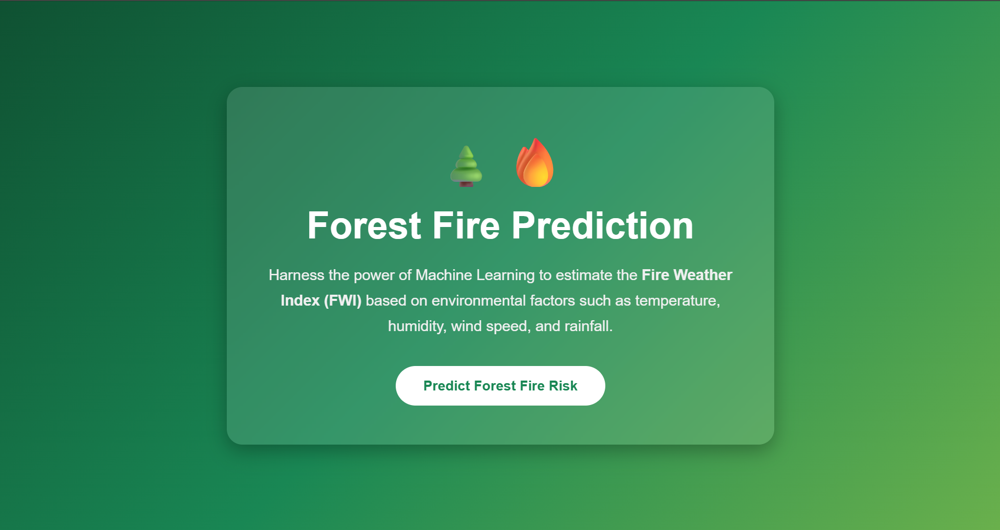
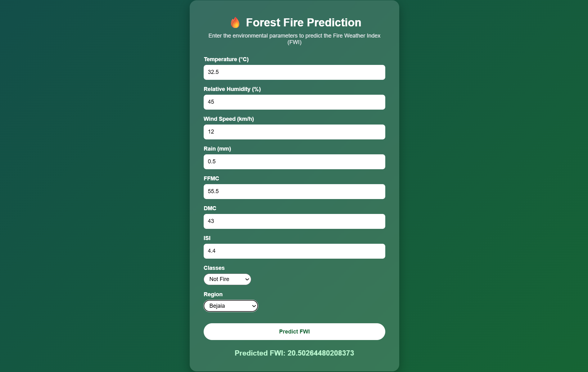

# 🔥 Forest Fire Predictor

A machine learning-powered web application that predicts the **Forest Fire Weather Index (FWI)** using environmental and weather-related parameters. The project uses a trained **Ridge Regression model** deployed through a **Flask** web interface, allowing users to enter real-time conditions and receive instant predictions.

---

## 📌 Project Overview

Forest fires are heavily influenced by weather conditions such as temperature, humidity, wind speed, and rainfall. This application uses a machine learning model trained on historical fire weather data to estimate the **Fire Weather Index (FWI)**, an indicator of potential fire intensity and risk.

Users can input various environmental factors through an intuitive web interface, and the model returns the predicted FWI value.

---

## ✨ Features

- Interactive and responsive web interface
- Real-time Forest Fire Weather Index prediction
- Data preprocessing using feature scaling
- Machine Learning model built with Ridge Regression
- Trained model serialization using Pickle
- End-to-end deployment using Flask

---

## 🛠️ Tech Stack

### Backend
- Python
- Flask

### Machine Learning
- Scikit-learn
- Ridge Regression
- NumPy
- Pandas

### Frontend
- HTML5
- CSS3

### Model Deployment
- Pickle

---

## 📂 Project Structure

```
ForestFirePred/
│
├── application.py          # Flask application and routes
├── models/
│   ├── ridge.pkl           # Trained Ridge Regression model
│   └── scaler.pkl          # StandardScaler used for preprocessing
│
├── templates/
│   ├── index.html          # Landing page
│   └── home.html    # Prediction form page
│
├── requirements.txt        # Python dependencies
├── README.md               # Project documentation
└── .gitignore
```

---

## 🚀 How to Run Locally

### 1. Clone the repository

```bash
git clone https://github.com/soumil-codes/forest-fire-predictor.git
```

### 2. Navigate into the project directory

```bash
cd forest-fire-predictor
```

### 3. Create and activate a virtual environment (Recommended)

**Windows**

```bash
python -m venv venv
venv\Scripts\activate
```

**Mac/Linux**

```bash
python3 -m venv venv
source venv/bin/activate
```

### 4. Install the required dependencies

```bash
pip install -r requirements.txt
```

### 5. Run the Flask application

```bash
python application.py
```

### 6. Open your browser

Go to:

```
http://127.0.0.1:5000
```

---

## 🔮 Future Improvements

- Add better visualizations of fire risk
- Deploy the application using cloud services
- Add user authentication and prediction history
- Improve the ML model using advanced algorithms
- Add API endpoints for external applications

---

## 📸 Application Preview

## 📸 Application Preview

### Landing Page



### Prediction Page



---

## 👨‍💻 Author

Developed as an end-to-end Machine Learning deployment project using Flask and Scikit-learn.
